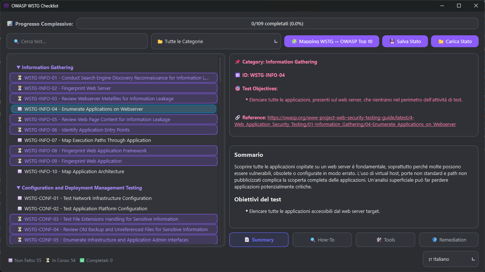
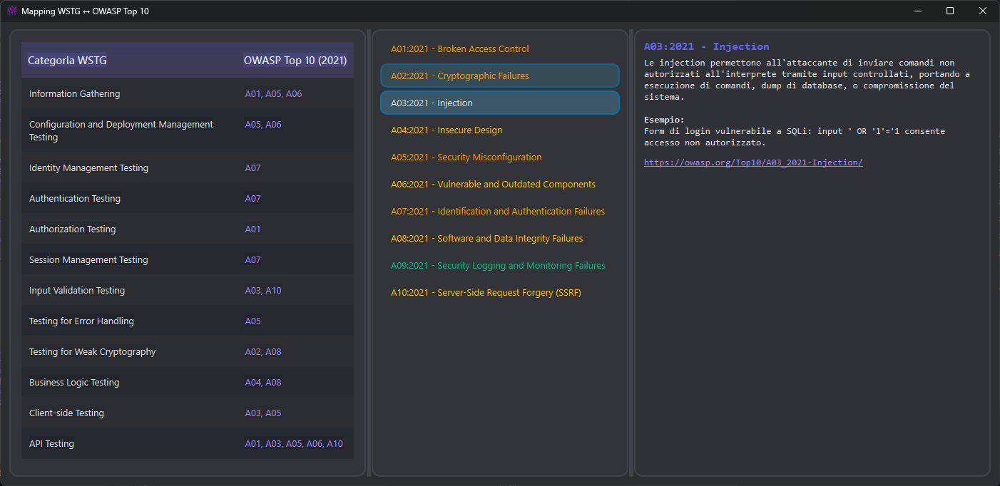

# OWASP WSTG Checklist Tracker

Applicazione desktop pensata per facilitare i Web Application Penetration Test (WAPT), permettendo di visualizzare e gestire in modo interattivo l'intera checklist delle OWASP Web Security Testing Guide (WSTG). Grazie al tracciamento dello stato di ogni test e alla possibilità di filtrare e annotare, l'app semplifica l'organizzazione e la documentazione delle attività durante un assessment. Ogni test è corredato da riferimenti, strumenti consigliati e misure di remediation.

Gli eseguibili per Windows e Linux sono disponibili nella sezione **Releases** del repository.

## Caratteristiche

* ✔️ Visualizzazione interattiva della checklist WSTG.
* 🔎 Ricerca dinamica e filtro per categoria.
* ✅ Stato dei test: "Non fatto", "In corso", "Completato".
* 📚 Dettagli offline per ogni test (How-To, Tools, Remediation).
* 🧩 Mappa visiva WSTG ↔ OWASP Top 10 (2021).
* 💾 Salvataggio/caricamento stato checklist in JSON.

## Requisiti

* Python 3.8+
* PyQt6

Installa le dipendenze con:

```bash
pip install -r requirements.txt
```

## Esecuzione da terminale

```bash
python main.py
```

La struttura del progetto è la seguente:

```
.
├── public/
│   ├── icon/
│   │   ├── icon_256x256.ico
│   │   ├── logo_app.png
│   │   └── logo_app_2.png
│   ├── json/
│   │   ├── category_descriptions.json
│   │   ├── checklist.json
│   │   ├── checklist_info_data.json
│   │   ├── owasp_top_10.json
│   │   └── progress.json
│   └── saves/
│       └── progress_temp.json
├── ui/
│   ├── main_window.py
│   └── loading_screen.py
└── main.py
```

## Salvataggio stato WSTG

Il file viene salvato in `saves/progress_temp.json` o in un file selezionato manualmente via GUI.

## Screenshot

### Lista dei test WSTG



Questa schermata mostra l'elenco completo dei test WSTG, organizzati per categoria. È possibile espandere o comprimere le sezioni, cambiare lo stato dei test con il tasto destro e visualizzare i dettagli nella parte destra della finestra. Ogni test include obiettivi, link ufficiali e un sommario tecnico.

---

### Mappatura OWASP Top 10



La seconda schermata evidenzia la corrispondenza tra le categorie WSTG e i rischi identificati dall'OWASP Top 10 (2021). Questo aiuta a comprendere quali vulnerabilità vengono coperte da ogni sezione della checklist e ad allineare i test alle priorità di rischio.

---

## Autore & Contatti

| Nome | Descrizione |
| --- | --- |
| <p dir="auto"><strong>Alberto Montefusco</strong> |<br>Developer - <a href="https://github.com/Alberto-00">Alberto-00</a></p><p dir="auto">LinkedIn - <a href="https://www.linkedin.com/in/alberto-montefusco">Alberto Montefusco</a></p><p dir="auto">My WebSite - <a href="https://alberto-00.github.io/">alberto-00.github.io</a></p><br>|
